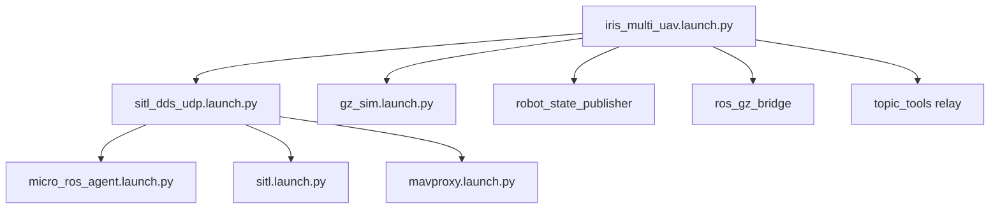

# ArduPilot Data to ROS2 Pipeline: Comprehensive Overview

## Executive Summary

This document provides a comprehensive overview of how ArduPilot data becomes readable ROS2 data through multiple transformation layers. The system uses three primary data pathways: **ArduPilot DDS (direct)**, **Gazebo Bridge (simulation)**, and **MAVROS (legacy)** to convert ArduPilot's internal data structures into standard ROS2 messages.

**Document Version:** 1.0  
**Last Updated:** August 26, 2025  
**ArduPilot Version:** 4.5+  
**ROS 2 Distribution:** Humble

## Table of Contents

1. [System Architecture Overview](#system-architecture-overview)
2. [Data Flow Analysis](#data-flow-analysis)
3. [ArduPilot DDS Pipeline](#ardupilot-dds-pipeline)
4. [Gazebo Simulation Pipeline](#gazebo-simulation-pipeline)
5. [Multi-UAV Implementation](#multi-uav-implementation)
6. [Message Transformation Details](#message-transformation-details)
7. [Launch File Analysis](#launch-file-analysis)
8. [Component Integration](#component-integration)
9. [Troubleshooting & Debug](#troubleshooting--debug)
10. [References](#references)

## System Architecture Overview

### High-Level Data Flow

```
┌─────────────────┐     ┌─────────────────┐     ┌─────────────────┐
│   ArduPilot     │────▶│  Transformation │────▶│     ROS 2       │
│   (Internal)    │     │     Layers      │     │   (Standard)    │
└─────────────────┘     └─────────────────┘     └─────────────────┘
        │                        │                        │
        │                        │                        │
    ┌───▼───┐              ┌─────▼─────┐            ┌─────▼─────┐
    │ IMU   │              │    DDS    │            │geometry_  │
    │ GPS   │              │  Micro-   │            │msgs       │
    │ BAT   │              │  ROS      │            │sensor_    │
    │ ...   │              │  Gazebo   │            │msgs       │
    └───────┘              └───────────┘            └───────────┘
```

### Three Primary Data Pathways

1. **ArduPilot DDS (Native)** - Direct ROS2 communication via Micro-ROS Agent
2. **Gazebo Bridge** - Simulation data via ros_gz_bridge 
3. **MAVROS (Legacy)** - MAVLink to ROS2 conversion (being phased out)

## Data Flow Analysis

### Based on Launch File Analysis

From `/iris_multi_uav.launch.py` and `/iris_runway.launch.py`:

#### Single UAV Data Flow
```
ArduPilot SITL ←→ Gazebo (ArduPilotPlugin) ←→ ros_gz_bridge ←→ ROS2 Topics
     ↓                                                           ↑
Micro-ROS Agent (UDP:2019) ────────────────────────────────────┘
     ↓
ArduPilot DDS Topics (/rt/ap/*)
```

#### Multi-UAV Data Flow (5 Instances)
```
SITL_1 (port:2019) ←→ Gazebo_Model_9002 ←→ Bridge_1 (ns:iris_9002) ←→ ROS2
SITL_2 (port:2029) ←→ Gazebo_Model_9012 ←→ Bridge_2 (ns:iris_9012) ←→ ROS2  
SITL_3 (port:2039) ←→ Gazebo_Model_9022 ←→ Bridge_3 (ns:iris_9022) ←→ ROS2
SITL_4 (port:2049) ←→ Gazebo_Model_9032 ←→ Bridge_4 (ns:iris_9032) ←→ ROS2
SITL_5 (port:2059) ←→ Gazebo_Model_9042 ←→ Bridge_5 (ns:iris_9042) ←→ ROS2
```

## ArduPilot DDS Pipeline

### Component Stack
```
┌─────────────────────────────────────────────────────────────────┐
│                    ROS 2 Application Layer                     │
├─────────────────────────────────────────────────────────────────┤
│                    Standard ROS 2 Messages                     │
│    geometry_msgs | sensor_msgs | ardupilot_msgs | tf2_msgs     │
├─────────────────────────────────────────────────────────────────┤
│                     Micro-ROS Agent                            │
│                    (UDP Port 2019+)                            │
├─────────────────────────────────────────────────────────────────┤
│                    ArduPilot DDS Client                        │
│              (Built-in ArduPilot SITL/Hardware)                │
└─────────────────────────────────────────────────────────────────┘
```

### DDS Topic Mappings

*Source: `AP_DDS_Topic_Table.h`*

#### Publishers (ArduPilot → ROS2)
**ACTUAL TOPIC STRUCTURE** *(verified from iris_runway launch)*

| ArduPilot Internal | **Actual** DDS Topic Name | ROS2 Message Type | Description |
|-------------------|----------------|-------------------|-------------|
| GPS Data | `/ap/navsat` | `sensor_msgs/NavSatFix` | GPS position/status |
| IMU Data | `/ap/imu/experimental/data` | `sensor_msgs/Imu` | Acceleration/gyro |
| Battery Monitor | `/ap/battery` | `sensor_msgs/BatteryState` | Battery voltage/current |
| EKF Position | `/ap/pose/filtered` | `geometry_msgs/PoseStamped` | Filtered position |
| EKF Velocity | `/ap/twist/filtered` | `geometry_msgs/TwistStamped` | Filtered velocity |
| Vehicle Status | `/ap/status` | `ardupilot_msgs/Status` | Armed/mode/failsafe |
| System Time | `/ap/time` | `builtin_interfaces/Time` | System timestamp |
| Airspeed | `/ap/airspeed` | `geometry_msgs/Vector3Stamped` | Airspeed vector |
| GeoPose | `/ap/geopose/filtered` | `geographic_msgs/GeoPoseStamped` | Global position |
| GPS Origin | `/ap/gps_global_origin/filtered` | `geographic_msgs/GeoPointStamped` | GPS origin |
| Goal Position | `/ap/goal_lla` | `geographic_msgs/GeoPointStamped` | Current goal |
| Clock | `/ap/clock` | `rosgraph_msgs/Clock` | Simulation clock |

#### Subscribers (ROS2 → ArduPilot)
**ACTUAL TOPIC STRUCTURE** *(verified from iris_runway launch)*

| **Actual** ROS2 Topic | ArduPilot Internal | Message Type | Purpose |
|------------|-------------------|--------------|---------|
| `/ap/cmd_vel` | Guided Mode Velocity | `geometry_msgs/TwistStamped` | Velocity commands |
| `/ap/cmd_gps_pose` | Guided Mode Position | `ardupilot_msgs/GlobalPosition` | GPS waypoints |
| `/ap/joy` | RC Override | `sensor_msgs/Joy` | Manual control |

#### Services (ROS2 ↔ ArduPilot)
**ACTUAL SERVICE STRUCTURE** *(verified from iris_runway launch)*

| **Actual** Service Name | Message Type | Function |
|-------------|--------------|----------|
| `/ap/arm_motors` | `ardupilot_msgs/srv/ArmMotors` | Arm/disarm motors |
| `/ap/mode_switch` | `ardupilot_msgs/srv/ModeSwitch` | Change flight mode |
| `/ap/experimental/takeoff` | `ardupilot_msgs/srv/Takeoff` | Takeoff command |
| `/ap/prearm_check` | `std_srvs/srv/Trigger` | Pre-flight safety checks |
| `/ap/get_parameters` | `rcl_interfaces/srv/GetParameters` | Get ArduPilot parameters |
| `/ap/set_parameters` | `rcl_interfaces/srv/SetParameters` | Set ArduPilot parameters |

### **IMPORTANT: Actual vs Expected Topic Structure**

**Key Discovery:** The actual topics use `/ap/*` prefix, **NOT** `/rt/ap/*` as shown in ArduPilot source code.

**Reason:** The Micro-ROS Agent likely strips the `/rt/` prefix during topic name translation from DDS to ROS2.

### Dual Data Sources Observed

From your topic list, you're seeing **both** ArduPilot DDS topics **and** Gazebo simulation topics:

#### ArduPilot DDS Topics (via Micro-ROS Agent)
```bash
/ap/navsat               # ArduPilot GPS data
/ap/imu/experimental/data # ArduPilot IMU data  
/ap/battery              # ArduPilot battery data
/ap/pose/filtered        # ArduPilot EKF position
/ap/status               # ArduPilot vehicle status
/ap/tf                   # ArduPilot transform data
/ap/tf_static            # ArduPilot static transforms
```

#### Gazebo Simulation Topics (via ros_gz_bridge)
```bash
/navsat                  # Simulated GPS sensor
/imu                     # Simulated IMU sensor
/battery                 # Simulated battery
/air_pressure            # Simulated barometer
/magnetometer            # Simulated magnetometer
/camera/image            # Simulated camera
/gz/tf                   # Gazebo transforms
/gz/tf_static            # Gazebo static transforms
```

#### ROS2 System Topics
```bash
/clock                   # ROS2 system clock
/tf                      # Combined transform tree
/tf_static               # Combined static transforms
/robot_description       # URDF/SDF robot model
```

### Configuration Details

**ArduPilot Parameters:**
```bash
DDS_ENABLE = 1
DDS_UDP_PORT = 2019  # Base port, +10 per instance
```

**Micro-ROS Agent Launch:**
```bash
ros2 run micro_ros_agent micro_ros_agent udp4 --port 2019 --verbose 4
```

## Gazebo Simulation Pipeline

### Component Stack
```
┌─────────────────────────────────────────────────────────────────┐
│                    ROS 2 Application Layer                     │
├─────────────────────────────────────────────────────────────────┤
│                    Standard ROS 2 Messages                     │
├─────────────────────────────────────────────────────────────────┤
│                    ros_gz_bridge                               │
│                 (Message Conversion)                           │
├─────────────────────────────────────────────────────────────────┤
│                    Gazebo Messages                             │
│                   (gz.msgs.*)                                  │
├─────────────────────────────────────────────────────────────────┤
│                    Gazebo Simulation                           │
│              (Sensor Plugins + Physics)                       │
├─────────────────────────────────────────────────────────────────┤
│                    ArduPilotPlugin                             │
│              (Gazebo ↔ ArduPilot SITL)                       │
└─────────────────────────────────────────────────────────────────┘
```

### Bridge Configuration Analysis

*Source: `iris_bridge.yaml`*

#### Sensor Data Bridges
```yaml
# Clock synchronization
- ros_topic_name: "clock"
  gz_topic_name: "/clock"
  ros_type_name: "rosgraph_msgs/msg/Clock"
  gz_type_name: "gz.msgs.Clock"
  direction: GZ_TO_ROS

# IMU data from simulation
- ros_topic_name: "imu"
  gz_topic_name: "/world/map/model/iris/link/imu_link/sensor/imu_sensor/imu"
  ros_type_name: "sensor_msgs/msg/Imu"
  gz_type_name: "gz.msgs.IMU"
  direction: GZ_TO_ROS

# GPS data from simulation  
- ros_topic_name: "navsat"
  gz_topic_name: "/world/map/model/iris/link/base_link/sensor/navsat_sensor/navsat"
  ros_type_name: "sensor_msgs/msg/NavSatFix"
  gz_type_name: "gz.msgs.NavSat"
  direction: GZ_TO_ROS

# Battery simulation
- ros_topic_name: "battery"
  gz_topic_name: "/model/iris/battery/linear_battery/state"
  ros_type_name: "sensor_msgs/msg/BatteryState"
  gz_type_name: "gz.msgs.BatteryState"
  direction: GZ_TO_ROS
```

### ArduPilotPlugin Communication

*Source: Analysis of `ArduPilotPlugin.hh` and SDF models*

The ArduPilotPlugin serves as the crucial link between Gazebo physics simulation and ArduPilot SITL:

#### Communication Ports
```
ArduPilot SITL ←──UDP──→ ArduPilotPlugin (Gazebo)
   Port 5501           Port 9002 (fdm_port_in)
                       Port 9003 (fdm_port_out)
```

#### Data Exchange
```cpp
// ArduPilot → Gazebo (Control Commands)
struct servo_packet {
  uint16_t motor_speed[16];  // Motor PWM values
  uint16_t pwm_outputs[16];  // Servo PWM values
};

// Gazebo → ArduPilot (Sensor Data)  
struct fdm_packet {
  double timestamp;
  double imu_angular_velocity_rpy[3];
  double imu_linear_acceleration_xyz[3];
  double imu_orientation_quat[4];
  double velocity_xyz[3];
  double position_xyz[3];
  // ... additional sensor data
};
```

### Multi-UAV Namespace Management

Each UAV instance gets its own:

| Instance | SITL Port | DDS Port | FDM Port | Gazebo Model | ROS2 Namespace |
|----------|-----------|----------|----------|--------------|----------------|
| 0 | 5501 | 2019 | 9002 | iris_9002 | iris_9002 |
| 1 | 5511 | 2029 | 9012 | iris_9012 | iris_9012 |
| 2 | 5521 | 2039 | 9022 | iris_9022 | iris_9022 |
| 3 | 5531 | 2049 | 9032 | iris_9032 | iris_9032 |
| 4 | 5541 | 2059 | 9042 | iris_9042 | iris_9042 |

## Multi-UAV Implementation

### Launch Sequence Analysis

*Source: `iris_multi_uav.launch.py`*

```python
# Staggered startup for resource management
sitl_dds_1    # Instance 0 - Start immediately
TimerAction(period=2.5, actions=[sitl_dds_2])   # Instance 1  
TimerAction(period=5.0, actions=[sitl_dds_3])   # Instance 2
TimerAction(period=7.5, actions=[sitl_dds_4])   # Instance 3
TimerAction(period=10.0, actions=[sitl_dds_5])  # Instance 4
TimerAction(period=18.0, actions=[gz_sim_server, gz_sim_gui])
```

### Resource Isolation

Each UAV instance maintains complete isolation:

#### Network Isolation
```bash
# SITL Communication Ports
SITL_1: master=tcp:5760, sitl=5501, out=14550
SITL_2: master=tcp:5770, sitl=5511, out=14560  
SITL_3: master=tcp:5780, sitl=5521, out=14570
SITL_4: master=tcp:5790, sitl=5531, out=14580
SITL_5: master=tcp:5800, sitl=5541, out=14590
```

#### DDS Port Isolation
```bash
# Micro-ROS Agent Ports
Agent_1: UDP 2019
Agent_2: UDP 2029
Agent_3: UDP 2039
Agent_4: UDP 2049
Agent_5: UDP 2059
```

#### ROS2 Namespace Isolation
```bash
# Topic Namespacing
/iris_9002/rt/ap/pose/filtered
/iris_9012/rt/ap/pose/filtered
/iris_9022/rt/ap/pose/filtered
/iris_9032/rt/ap/pose/filtered
/iris_9042/rt/ap/pose/filtered
```

## Message Transformation Details

### ArduPilot Internal → DDS Messages

#### IMU Data Transformation
```cpp
// ArduPilot Internal (AP_InertialSensor)
struct {
  Vector3f accel;     // m/s²
  Vector3f gyro;      // rad/s
  Quaternion quat;    // orientation
} ap_imu_data;

// ROS2 sensor_msgs/Imu
sensor_msgs::msg::Imu ros_imu;
ros_imu.linear_acceleration.x = ap_imu_data.accel.x;
ros_imu.linear_acceleration.y = ap_imu_data.accel.y;  
ros_imu.linear_acceleration.z = ap_imu_data.accel.z;
ros_imu.angular_velocity.x = ap_imu_data.gyro.x;
ros_imu.angular_velocity.y = ap_imu_data.gyro.y;
ros_imu.angular_velocity.z = ap_imu_data.gyro.z;
```

#### GPS Data Transformation
```cpp
// ArduPilot Internal (AP_GPS)
struct {
  int32_t latitude;   // degrees * 1e7
  int32_t longitude;  // degrees * 1e7  
  int32_t altitude;   // mm above MSL
  uint8_t satellites; // satellite count
  uint8_t fix_type;   // GPS fix type
} ap_gps_data;

// ROS2 sensor_msgs/NavSatFix
sensor_msgs::msg::NavSatFix ros_gps;
ros_gps.latitude = ap_gps_data.latitude * 1e-7;
ros_gps.longitude = ap_gps_data.longitude * 1e-7;
ros_gps.altitude = ap_gps_data.altitude * 1e-3;
```

#### Custom ArduPilot Messages
```cpp
// ArduPilot Status → ardupilot_msgs/Status
ardupilot_msgs::msg::Status status_msg;
status_msg.armed = copter.motors->armed();
status_msg.mode = copter.control_mode;
status_msg.vehicle_type = APM_BUILD_TYPE();
status_msg.flying = copter.ap.land_complete;
```

### Gazebo Messages → ROS2 Transformation

#### Gazebo IMU → ROS2 IMU
```cpp
// gz.msgs.IMU
gazebo_msgs.orientation().w()  → ros_imu.orientation.w
gazebo_msgs.orientation().x()  → ros_imu.orientation.x
gazebo_msgs.orientation().y()  → ros_imu.orientation.y
gazebo_msgs.orientation().z()  → ros_imu.orientation.z

gazebo_msgs.angular_velocity().x() → ros_imu.angular_velocity.x
gazebo_msgs.angular_velocity().y() → ros_imu.angular_velocity.y
gazebo_msgs.angular_velocity().z() → ros_imu.angular_velocity.z
```

## Launch File Analysis

### Component Dependencies

*Source: Launch file analysis*



### Key Launch Parameters

#### SITL Configuration
```python
launch_arguments={
    "transport": "udp4",           # UDP transport for DDS
    "port": "2019",               # Base DDS port
    "synthetic_clock": "True",     # Synchronized simulation time
    "model": "json",              # JSON communication with Gazebo
    "speedup": "1",               # Real-time simulation
    "instance": "0",              # Multi-instance support
    "defaults": "gazebo-iris-gimbal.parm,dds_udp.parm"  # Parameter files
}
```

#### Bridge Configuration  
```python
bridge_parameters = {
    "config_file": "iris_bridge.yaml",  # Message mapping config
    "qos_overrides./tf_static.publisher.durability": "transient_local"
}
```

## Component Integration

### Micro-ROS Agent

*Source: `MicroRosAgentLaunch` class analysis*

```python
# Micro-ROS Agent Configuration
args = [
    "udp4",                    # Transport protocol
    "--middleware", "dds",     # DDS middleware
    "--port", "2019",          # UDP port
    "--verbose", "4"           # Debug level
]
```

**Function:** Bridges ArduPilot's Micro-ROS DDS client to full ROS2 DDS network

### Robot State Publisher

Publishes robot description and transforms:
```python
robot_state_publisher = Node(
    package="robot_state_publisher",
    executable="robot_state_publisher",
    parameters=[
        {"robot_description": sdf_content},  # From SDF model
        {"frame_prefix": "iris_9002/"}       # Namespace prefix
    ]
)
```

### Transform Management

#### TF Static (Robot Description)
- **Source:** robot_state_publisher
- **Content:** Fixed transforms between robot links
- **Durability:** transient_local (persists for late joiners)

#### TF Dynamic (Motion Data)
- **Gazebo Path:** `/gz/tf` → topic_tools relay → `/tf`
- **DDS Path:** `/rt/ap/tf` (direct from ArduPilot)

## Troubleshooting & Debug

### Common Data Flow Issues

#### 1. DDS Connection Problems
```bash
# Check Micro-ROS Agent connectivity
ros2 run micro_ros_agent micro_ros_agent udp4 --port 2019 --verbose 6

# Verify ArduPilot DDS parameters
param show DDS_*
```

#### 2. Gazebo Bridge Issues
```bash
# Check bridge configuration
ros2 param get /bridge_1 config_file

# Monitor bridge topics
ros2 topic list | grep iris_9002
```

#### 3. Multi-UAV Namespace Conflicts
```bash
# Verify namespace isolation
ros2 topic list | sort
ros2 node list | grep -E "(iris_|bridge_)"
```

#### 4. Timing Issues
```bash
# Check clock synchronization
ros2 topic echo /clock
ros2 topic echo /iris_9002/clock
```

### Debug Commands

#### Monitor Data Flow
```bash
# ArduPilot DDS topics (CORRECTED - actual topic names)
ros2 topic list | grep "/ap/"
ros2 topic hz /ap/pose/filtered
ros2 topic hz /ap/imu/experimental/data

# Gazebo simulation topics  
ros2 topic hz /imu
ros2 topic hz /navsat
ros2 topic hz /battery

# Compare ArduPilot vs Gazebo data
ros2 topic echo /ap/navsat        # ArduPilot GPS
ros2 topic echo /navsat           # Gazebo GPS simulation

# Transform trees
ros2 run tf2_tools view_frames
```

#### Verify iris_runway Launch Topics
Based on your actual launch output:
```bash
# Core ArduPilot DDS topics
ros2 topic hz /ap/pose/filtered         # ~50Hz
ros2 topic hz /ap/imu/experimental/data # ~100Hz  
ros2 topic hz /ap/navsat                # ~10Hz
ros2 topic hz /ap/battery               # ~1Hz

# Gazebo sensor simulation
ros2 topic hz /imu                      # ~100Hz
ros2 topic hz /air_pressure             # ~10Hz
ros2 topic hz /magnetometer             # ~10Hz
ros2 topic hz /camera/image             # ~30Hz
```

#### Parameter Verification
```bash
# ArduPilot parameters (in MAVProxy)
param show DDS_*
param show SERIAL1_*

# ROS2 parameters
ros2 param list | grep micro_ros_agent
```

### Performance Monitoring

#### Topic Rates
```bash
# Expected rates (approximate)
/rt/ap/imu/experimental/data     # 100Hz
/rt/ap/pose/filtered            # 50Hz  
/rt/ap/navsat                   # 10Hz
/rt/ap/battery                  # 1Hz
```

#### Resource Usage
```bash
# Monitor system resources
htop
ros2 daemon status
gz stats
```

## Verified iris_runway Launch Analysis

### Actual Topic Output
**Command:** `ros2 launch ardupilot_gz_bringup iris_runway.launch.py rviz:=true use_gz_tf:=true`

**Complete topic list observed:**
```bash
/air_pressure                    # Gazebo barometer sensor
/ap/airspeed                    # ArduPilot airspeed estimate  
/ap/battery                     # ArduPilot battery monitor
/ap/clock                       # ArduPilot simulation clock
/ap/cmd_gps_pose               # ArduPilot GPS command input
/ap/cmd_vel                    # ArduPilot velocity command input
/ap/geopose/filtered           # ArduPilot global position (EKF)
/ap/goal_lla                   # ArduPilot current goal position
/ap/gps_global_origin/filtered # ArduPilot GPS origin reference
/ap/imu/experimental/data      # ArduPilot IMU data
/ap/joy                        # ArduPilot joystick input
/ap/navsat                     # ArduPilot GPS data
/ap/pose/filtered              # ArduPilot local position (EKF)
/ap/status                     # ArduPilot vehicle status
/ap/tf                         # ArduPilot dynamic transforms
/ap/tf_static                  # ArduPilot static transforms
/ap/time                       # ArduPilot system time
/ap/twist/filtered             # ArduPilot velocity (EKF)
/battery                       # Gazebo battery simulation
/camera/camera_info            # Gazebo camera parameters
/camera/image                  # Gazebo camera stream
/clicked_point                 # RViz clicked point
/clock                         # ROS2 master clock
/goal_pose                     # RViz goal pose
/gz/tf                         # Gazebo dynamic transforms
/gz/tf_static                  # Gazebo static transforms  
/imu                           # Gazebo IMU simulation
/initialpose                   # RViz initial pose
/joint_states                  # Robot joint states
/magnetometer                  # Gazebo magnetometer simulation
/navsat                        # Gazebo GPS simulation
/odometry                      # Gazebo odometry
/parameter_events              # ROS2 parameter changes
/robot_description             # Robot URDF/SDF description
/rosout                        # ROS2 logging
/tf                            # Combined transform tree
/tf_static                     # Combined static transforms
```

### Key Observations

1. **Topic Prefix Correction:** ArduPilot DDS topics use `/ap/` prefix, not `/rt/ap/`
2. **Dual Data Sources:** Both ArduPilot real data and Gazebo simulated data available
3. **Complete Sensor Suite:** IMU, GPS, battery, barometer, magnetometer, camera
4. **Transform Integration:** Separate `/ap/tf`, `/gz/tf`, and combined `/tf` trees
5. **Command Interfaces:** Both velocity (`/ap/cmd_vel`) and position (`/ap/cmd_gps_pose`) control
6. **Status Monitoring:** Vehicle status via `/ap/status` topic

### Data Source Comparison

| Sensor Type | ArduPilot DDS | Gazebo Simulation | Purpose |
|------------|---------------|-------------------|---------|
| **IMU** | `/ap/imu/experimental/data` | `/imu` | Compare real vs simulated |
| **GPS** | `/ap/navsat` | `/navsat` | Compare real vs simulated |
| **Battery** | `/ap/battery` | `/battery` | Compare real vs simulated |
| **Transforms** | `/ap/tf` | `/gz/tf` | Different coordinate frames |
| **Odometry** | `/ap/pose/filtered` | `/odometry` | EKF vs physics engine |

This setup allows for **sensor fusion validation** and **simulation-to-reality transfer** by comparing ArduPilot's sensor processing with Gazebo's ground truth simulation.

### Verified Service Analysis

**Complete service list from iris_runway launch:**

#### ArduPilot Control Services
```bash
/ap/arm_motors              # Arm/disarm vehicle motors
/ap/experimental/takeoff    # Execute takeoff sequence  
/ap/mode_switch            # Change flight/drive mode
/ap/prearm_check           # Run pre-flight safety checks
/ap/get_parameters         # Get ArduPilot parameters
/ap/set_parameters         # Set ArduPilot parameters
```

#### ROS2 Node Parameter Services
Each ROS2 node provides standard parameter services:

**Topic Relay Node (`/relay`):**
```bash
/relay/describe_parameters
/relay/get_parameter_types
/relay/get_parameters
/relay/list_parameters
/relay/set_parameters
/relay/set_parameters_atomically
```

**Robot State Publisher (`/robot_state_publisher`):**
```bash
/robot_state_publisher/describe_parameters
/robot_state_publisher/get_parameter_types
/robot_state_publisher/get_parameters
/robot_state_publisher/list_parameters
/robot_state_publisher/set_parameters
/robot_state_publisher/set_parameters_atomically
```

**Gazebo Bridge (`/ros_gz_bridge`):**
```bash
/ros_gz_bridge/describe_parameters
/ros_gz_bridge/get_parameter_types
/ros_gz_bridge/get_parameters
/ros_gz_bridge/list_parameters
/ros_gz_bridge/set_parameters
/ros_gz_bridge/set_parameters_atomically
```

**RViz (`/rviz`):**
```bash
/rviz/describe_parameters
/rviz/get_parameter_types
/rviz/get_parameters
/rviz/list_parameters
/rviz/set_parameters
/rviz/set_parameters_atomically
```

### Service Usage Examples

#### Arm the Vehicle
```bash
ros2 service call /ap/arm_motors ardupilot_msgs/srv/ArmMotors "{arm: true}"
```

#### Change to Guided Mode
```bash  
ros2 service call /ap/mode_switch ardupilot_msgs/srv/ModeSwitch "{mode: 4}"
# Mode 4 = GUIDED for ArduCopter
```

#### Run Pre-arm Checks
```bash
ros2 service call /ap/prearm_check std_srvs/srv/Trigger "{}"
```

#### Set ArduPilot Parameter
```bash
ros2 service call /ap/set_parameters rcl_interfaces/srv/SetParameters "{
  parameters: [
    {
      name: 'WPNAV_SPEED',
      value: {type: 3, double_value: 500.0}
    }
  ]
}"
```

### Key Service Observations

1. **Service Prefix Consistency:** Like topics, services use `/ap/` prefix (not `/rs/ap/`)
2. **Complete Vehicle Control:** Full ArduPilot command interface available
3. **Parameter Access:** Direct ROS2-style parameter get/set for ArduPilot
4. **Safety Integration:** Pre-arm checks accessible via standard ROS2 service
5. **Standard ROS2 Patterns:** All nodes follow ROS2 parameter service conventions

## References

[1] **ArduPilot Multi-UAV Launch File**  
    Path: `/iris_multi_uav.launch.py`  
    *Primary launch file configuring 5-UAV simulation with complete data pipeline*

[2] **ArduPilot Single UAV Launch File**  
    Path: `/iris_runway.launch.py`  
    *Benchmark single-UAV configuration for comparison*

[3] **SITL DDS UDP Launch Configuration**  
    Path: `/sitl_dds_udp.launch.py`  
    *Core ArduPilot SITL with DDS configuration*

[4] **Micro-ROS Agent Implementation**  
    Path: `/ardupilot_sitl/launch.py` (MicroRosAgentLaunch class)  
    *Micro-ROS Agent configuration and launch logic*

[5] **Gazebo Bridge Configuration**  
    Path: `/iris_bridge.yaml`  
    *Complete Gazebo to ROS2 message mapping configuration*

[6] **ArduPilot DDS Topic Table**  
    Path: `/libraries/AP_DDS/AP_DDS_Topic_Table.h`  
    *Native ArduPilot DDS topic definitions and QoS settings*

[7] **ArduPilot DDS Service Table**  
    Path: `/libraries/AP_DDS/AP_DDS_Service_Table.h`  
    *ArduPilot DDS service interfaces for vehicle control*

[8] **ArduPilotPlugin for Gazebo**  
    Path: `/ardupilot_gazebo/src/ArduPilotPlugin.cc`  
    *Gazebo plugin connecting physics simulation to ArduPilot SITL*

[9] **DDS Parameter Configuration**  
    Path: `/dds_udp.parm`  
    *ArduPilot parameter file enabling DDS communication*

[10] **Gazebo Model Definitions**  
    Path: `/models/iris_with_gimbal*/model.sdf`  
    *SDF model files with sensor configurations and ArduPilotPlugin setup*

### Additional Resources

- **ArduPilot DDS Documentation**: https://ardupilot.org/dev/docs/ros2-interfaces.html
- **Gazebo ROS2 Integration**: https://gazebosim.org/api/ros_gz/1.0/index.html
- **Micro-ROS Documentation**: https://micro.ros.org/
- **ROS2 Launch System**: https://docs.ros.org/en/humble/Concepts/About-Launch-System.html

### System Requirements

- **ArduPilot**: 4.5.0+ (DDS support)
- **ROS 2**: Humble Hawksbill
- **Gazebo**: Garden (gz-sim7)
- **Micro-ROS Agent**: 4.0.0+
- **Python**: 3.10+

This comprehensive overview demonstrates how ArduPilot's internal data structures are transformed through multiple layers to become standard ROS2 messages, enabling seamless integration with the broader ROS2 ecosystem.